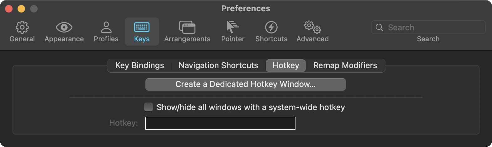
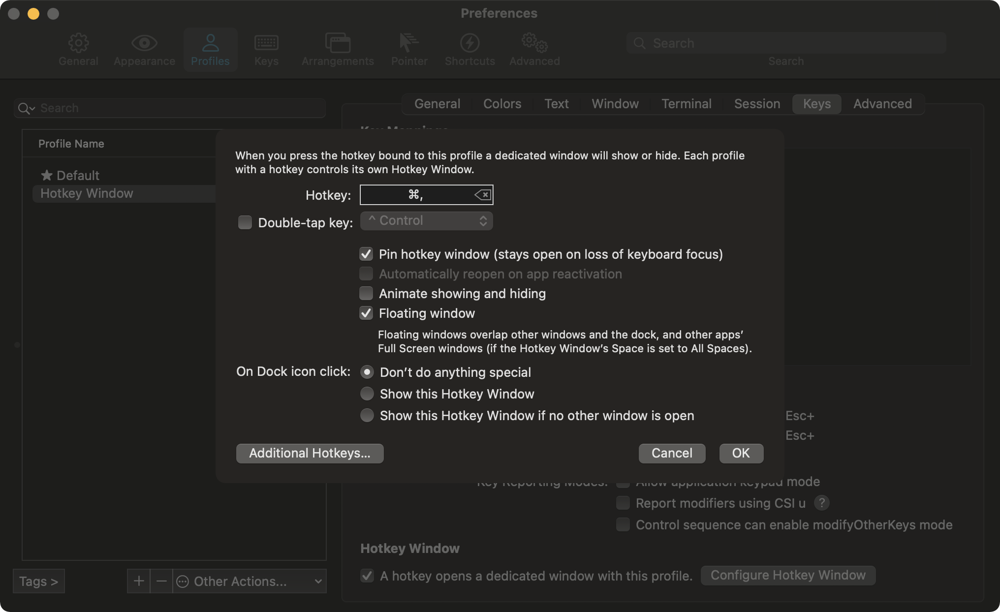

Perhaps you noticed it, I did not mention my terminal windows in the last post called [Mac Window management with Amethyst](/mac-window-management).

A terminal window is a special window; I need to access it:

- from **everywhere**,
- very **fast**.

Once I have accessed it, I should:

- be able to **type** quickly,
- **jump to any word** quickly.

# Iterm 2

As Iterm describes itself, it is "a replacement for Terminal that does amazing things".
Download and install it [here](https://iterm2.com/).

# Hotkey window

A Hotkey window is a terminal window that is accessible from a **keyboard shortcut** !

## Create a dedicated profile

To create a Hotkey window, you need to:

1. launch iterm2;
2. open the preferences;
3. choose the **Keys** tab;
4. choose the **Hotkey** tab inside;
5. click the "Create a Dedicated Hotkey Window".

## Choose a shortcut

- I recommend choosing `cmd+,` on AZERTY keyboards (or `cmd+m` on QWERTY).
- uncheck "animating showing and hiding" so that you can focus the terminal quickly.
- check "pin window" so that the terminal stays on top until you explicitly use the shortcut again.

